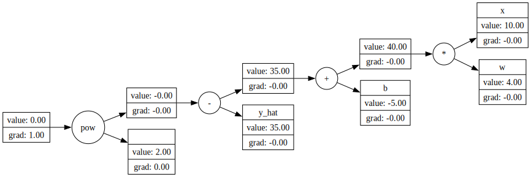
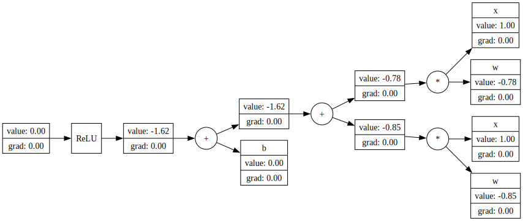

# telegrad

Rust implementation of [micrograd](https://github.com/karpathy/micrograd) for educational purposes to learn Rust and Neural networks.



There are binaries for examples of linear regressions, logistic regression and a small neural network for recognizing zeros and ones a small subset of the MNIST dataset.

Main difference from micrograd, except of using Rust, is that the nodes are stored on a stack to get a topological order of the graph while creating it, instead of sorting it at backpropagation. Another difference is that the node graph is only constructed once, and then traversed instead of recreated during training or prediction.

You can like in micrograd create a graph using operator overloading like this:

```rust
    println!("Test simple linear regression");
    fn f_target(x: f32) -> f32 { x * 4. - 5. }
    let ns = NodeStack::new(); // Stack to store graph

    val!(ns, w, 2.); // macro to create variables with a label
    val!(ns, b, 1.);
    val!(ns, x, 1.);
    val!(ns, y_hat, f_target(1.));

    let f = x * w + b;
    let loss = (&f - y_hat).pow(&ns.val(2.)); // squared error term
    ...
```

You can create a SVG file for a given graph like in this small example of creating a neuron with two inputs.

```rust
#[test]
fn test_neuron() {
    let ns = NodeStack::new();
    let input = (0..2).map(|_| ns.val_labeled(1., "x")).collect();
    let n = Neuron::new(ns.clone(), input, UnaryOp::ReLu);
    ns.create_svg(&n.output, "neuron.svg");
    println!("neuron: {:?}", &n);
}
```
Resulting in this image

